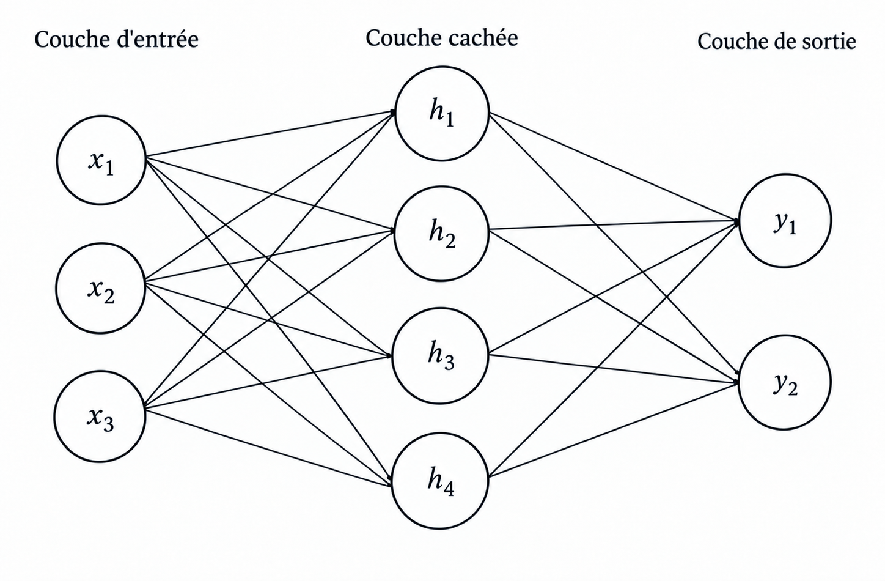

# CSC8607 — Introduction au Deep Learning

## TP1 — Premiers pas

**Étudiant :** Mohamed Rayen Jomaa

**Date :** 17/09/2026

---

## Exercice 1. Utilisation de SLURM

### 1.1 Mode interactif avec `srun`

La commande `nvidia-smi` lancée directement sur le nœud `controller` ne fonctionne pas, car ce nœud ne possède pas de GPU accessible.

J'ai demandé un nœud de calcul avec un GPU en utilisant :

```bash
srun --partition=gpu --gres=gpu:1 --time=01:00:00 --cpus-per-task=1 --mem=8G --pty bash
```

Une fois connecté au nœud de calcul, la commande :

```bash
nvidia-smi
```

indique que le GPU qui m'a été attribué est :

**NVIDIA L4**

Le GPU possède environ **23 Go de mémoire vidéo**.

### 1.2 Visualisation et arrêt d'un job

La commande permettant d'afficher mes jobs SLURM est :

```bash
squeue -u $USER
```

Mon job interactif avait pour identifiant :

```text
1597
```

Son état était `R`, ce qui signifie **Running**.

La commande utilisée pour arrêter ce job est :

```bash
scancel 1597
```

### 1.3 Soumission d'un job avec `sbatch`

J'ai soumis mon script `hello.sh` avec :

```bash
sbatch hello.sh
```

Le script demandait les ressources suivantes :

- 1 GPU ;
- 1 CPU ;
- 8 Go de RAM ;
- une durée maximale de 1 heure.

Le fichier de sortie généré pour mon job est :

```text
hello-slurm-1595.out
```

Le fichier d'erreur correspondant est :

```text
hello-slurm-1595.err
```

Le fichier `.err` était vide, ce qui indique qu'aucune erreur n'a été produite lors de l'exécution.

Le fichier de sortie confirme également que le job a été exécuté sur un GPU **NVIDIA L4**.

### 1.4 Analyse du job avec `sacct`

J'ai analysé le job `1595` avec la commande :

```bash
sacct -j 1595 --format=JobID,State,Elapsed,MaxRSS,ReqMem,ReqCPUS
```

J'ai obtenu :

```text
JobID             State    Elapsed     MaxRSS     ReqMem  ReqCPUS
------------ ---------- ---------- ---------- ---------- --------
1595          COMPLETED   00:00:01                    8G        1
1595.batch    COMPLETED   00:00:01     17988K                   1
1595.extern   COMPLETED   00:00:02                              1
```

Le job s'est terminé correctement avec l'état `COMPLETED`.

`ReqMem` correspond à la quantité de mémoire demandée à SLURM lors de la soumission du job.

`MaxRSS` correspond à la quantité maximale de mémoire RAM réellement utilisée pendant l'exécution du job.

Dans mon cas, j'ai demandé **8 Go de RAM** (`ReqMem = 8G`), alors que le processus batch a réellement utilisé au maximum environ **17,6 MiB** (`MaxRSS = 17988K`).

---

## Exercice 2. Création d'un environnement virtuel Python

### 2.1 Environnement `deeplearning`

J'ai créé un environnement Mamba nommé `deeplearning` avec Python 3.10 :

```bash
mamba create -n deeplearning python=3.10
mamba activate deeplearning
```

Pour vérifier la version exacte de Python ainsi que le chemin du binaire utilisé, j'ai exécuté :

```bash
python --version
which python
```

Résultat :

```text
Python 3.10.21
/mnt/hdd/homes/mjomaa/miniforge3/envs/deeplearning/bin/python
```

### 2.2 Vérification de PyTorch et CUDA

J'ai vérifié que PyTorch détecte correctement le GPU avec le script `check_gpu.py`.

Commande exécutée :

```bash
python check_gpu.py
```

Résultat :

```text
PyTorch version: 2.5.1.post303
CUDA available: True
Device count: 1
Device 0 name: NVIDIA L4
```

CUDA est donc bien disponible dans PyTorch et le GPU détecté est un **NVIDIA L4**.

### 2.3 Vérification de TensorBoard

Pour vérifier la version de TensorBoard installée, j'ai utilisé la commande :

```bash
tensorboard --version
```

La version installée est :

```text
2.20.0
```

TensorBoard est donc correctement installé dans l'environnement `deeplearning`.

---

## Exercice 3. Exercices théoriques

### 3.1 Architecture et paramètres

Le MLP considéré possède :

- 3 neurones dans la couche d'entrée ;
- 4 neurones dans la couche cachée ;
- 2 neurones dans la couche de sortie.



#### Nombre de paramètres sans les biais

Entre la couche d'entrée et la couche cachée :


$$ 3 \times 4 = 12 $$


Entre la couche cachée et la couche de sortie :

$$ 4 \times 2 = 8 $$


Le nombre total de paramètres sans les biais est donc :

$$ 12 + 8 = 20 $$

#### Nombre de paramètres avec les biais

La couche cachée possède 4 biais et la couche de sortie possède 2 biais.

Le nombre total de paramètres est donc :

$$ 20 + 4 + 2 = 26 $$

### 3.2 Équations et dimensions

Le forward pass est défini par :

```text
H = ReLU(X · W1^T + b1)
Y = H · W2^T + b2
```

Les dimensions sont :

```text
X  : (N, 3)
W1 : (4, 3)
b1 : (1, 4) -> diffusé en (N, 4)
H  : (N, 4)
W2 : (2, 4)
b2 : (1, 2) -> diffusé en (N, 2)
Y  : (N, 2)
```

En effet :

- `X` contient `N` exemples avec 3 caractéristiques chacun ;
- `W1^T` est de taille `(3, 4)`, donc `X · W1^T` donne `(N, 4)` ;
- après ajout de `b1` et application de ReLU, `H` reste de taille `(N, 4)` ;
- `W2^T` est de taille `(4, 2)`, donc `H · W2^T` donne `(N, 2)` ;
- après ajout de `b2`, la sortie finale `Y` est de taille `(N, 2)`.

### 3.3 Graphe de calcul et rétropropagation

On considère la fonction :


$$ f(x,y,z)=\frac{x}{y}+z $$


On introduit la variable intermédiaire :

$$ q=\frac{x}{y} $$

Le graphe de calcul est donc :

```text
x ──┐
    ├──> q = x/y ──┐
y ──┘               ├──> f = q + z
z ──────────────────┘
```

#### Forward pass

Pour :

$$ x=2, \qquad     y=4, \qquad   z=0 $$

on calcule d'abord :

$$ q=\frac{x}{y}=\frac{2}{4}=0.5 $$

puis :

$$ f=q+z=0.5+0=0.5 $$

La sortie est donc :

$$ \boxed{f=0.5} $$

#### Backpropagation

On commence par les dérivées de la dernière opération :


$$ f=q+z $$


donc :


$$ \frac{\partial f}{\partial q}=1 $$

et :

$$ \frac{\partial f}{\partial z}=1 $$

Pour :

$$ q=\frac{x}{y} $$

on a :

$$ \frac{\partial q}{\partial x}=\frac{1}{y} $$

et :

$$ \frac{\partial q}{\partial y}=-\frac{x}{y^2} $$

En appliquant la règle de la chaîne :

$$
\frac{\partial f}{\partial x}
=
\frac{\partial f}{\partial q}
\frac{\partial q}{\partial x}
=
1 \times \frac{1}{4}
=
\boxed{0.25}
$$
Pour $y$ :

```math
\frac{\partial f}{\partial y}
=
\frac{\partial f}{\partial q}
\frac{\partial q}{\partial y}
=
1 \times \left(-\frac{2}{4^2}\right)
=
-\frac{2}{16}
=
\boxed{-0.125}
```

Enfin :

```math
\frac{\partial f}{\partial z}
=
\boxed{1}
```

Les gradients obtenus sont donc :

```math
\frac{\partial f}{\partial x}=0.25,
\qquad
\frac{\partial f}{\partial y}=-0.125,
\qquad
\frac{\partial f}{\partial z}=1
```

### 3.4 Mise à jour des poids

On utilise une étape de descente de gradient avec :

```math
\eta = 1
```

Les gradients obtenus précédemment sont :

```math
\frac{\partial f}{\partial x}=0.25
```

```math
\frac{\partial f}{\partial y}=-0.125
```

```math
\frac{\partial f}{\partial z}=1
```

La règle de mise à jour est :

```math
\theta' = \theta - \eta \frac{\partial f}{\partial \theta}
```

#### Mise à jour de $x$

```math
x' = 2 - 1 \times 0.25
```

```math
\boxed{x'=1.75}
```

#### Mise à jour de $y$

```math
y' = 4 - 1 \times (-0.125)
```

```math
\boxed{y'=4.125}
```

#### Mise à jour de $z$

```math
z' = 0 - 1 \times 1
```

```math
\boxed{z'=-1}
```

La nouvelle sortie est :

```math
f'=\frac{x'}{y'}+z'
```

```math
f'=\frac{1.75}{4.125}-1
```

```math
f' \approx 0.4242-1
```

```math
\boxed{f' \approx -0.5758}
```

Avant la mise à jour :

```math
f=0.5
```

Après la mise à jour :

```math
f' \approx -0.5758
```

La valeur de la fonction a donc bien diminué, ce qui est le comportement attendu lors d'une étape de descente de gradient.

### 3.5 Questions de réflexion

#### Pourquoi utilise-t-on la règle de la chaîne dans les réseaux de neurones profonds ?

Un réseau de neurones est composé de plusieurs fonctions imbriquées les unes dans les autres. La règle de la chaîne permet de calculer le gradient de la fonction de perte par rapport aux paramètres de chaque couche en propageant les gradients de la sortie vers l'entrée.

#### Pourquoi utiliser des mini-batchs ?

Les mini-batchs offrent un compromis entre l'apprentissage exemple par exemple et l'utilisation de tout le dataset en une seule fois. Ils permettent d'exploiter efficacement le parallélisme des GPU, de limiter l'utilisation de la mémoire et donnent des estimations du gradient suffisamment stables pour l'entraînement.

### 3.6 Association : sortie et fonction de perte

| Tâche | Fonction finale (sortie) | Fonction de perte |
| --- | --- | --- |
| Classification binaire | Sigmoid | Binary Cross-Entropy (BCE) |
| Classification multiclasse | Softmax | Cross-Entropy |
| Régression pure | Identité (aucune activation) | MSE (Mean Squared Error) |

---

## Exercice 4. Premier réseau de neurones

### 4.1 Préparation des données

#### Rôle de `batch_size` et `shuffle`

L'argument `batch_size` indique le nombre d'exemples traités simultanément par le modèle avant chaque mise à jour des paramètres. Par exemple, avec :

```python
batch_size=32
```

les images sont traitées par groupes de 32.

L'argument `shuffle` indique si l'ordre des exemples doit être mélangé avant chaque parcours du dataset.

Pour l'ensemble d'entraînement, on utilise :

```python
shuffle=True
```

afin de présenter les exemples dans un ordre différent à chaque époque. Cela évite que le modèle apprenne des dépendances liées à l'ordre des données et améliore généralement l'entraînement.

Pour l'ensemble de test, on utilise :

```python
shuffle=False
```

car le modèle n'est plus entraîné : on cherche seulement à mesurer ses performances. Il n'est donc pas nécessaire de mélanger les exemples, et garder un ordre fixe rend l'évaluation plus reproductible.

### 4.2 Implémentation du réseau

#### Pourquoi utilise-t-on `torch.flatten(x, 1)` ?

Les images CIFAR-10 ont une forme `(batch_size, 3, 32, 32)`, alors qu'une couche linéaire `nn.Linear` attend des vecteurs en entrée.

La commande :

```python
torch.flatten(x, 1)
```

aplatit chaque image en un vecteur de taille :

```math
3 \times 32 \times 32 = 3072
```

tout en conservant la première dimension correspondant au batch.

Ainsi, la forme des données passe de :

```text
(batch_size, 3, 32, 32)
```

à :

```text
(batch_size, 3072)
```

ce qui permet de transmettre correctement les données à la première couche linéaire du MLP.

#### Pourquoi ne faut-il pas appliquer `Softmax` avant `nn.CrossEntropyLoss` ?

Il ne faut pas appliquer `Softmax` à la sortie du réseau avant d'utiliser `nn.CrossEntropyLoss`.

La fonction `nn.CrossEntropyLoss` attend directement les **logits**, c'est-à-dire les sorties brutes de la dernière couche linéaire.

Elle combine déjà en interne une opération de type `LogSoftmax` avec la fonction de perte correspondante.

Ajouter un `Softmax` manuellement serait donc inutile et pourrait rendre le calcul moins stable numériquement.

### 4.3 Entraînement du modèle

Le modèle a été entraîné pendant 10 époques sur le GPU.

Résultats obtenus :

```text
Using device: cuda
Epoch 01 | loss=2.0830 | acc=0.3334
Epoch 02 | loss=2.1251 | acc=0.3586
Epoch 03 | loss=2.1198 | acc=0.3682
Epoch 04 | loss=2.0930 | acc=0.3819
Epoch 05 | loss=2.0538 | acc=0.3897
Epoch 06 | loss=2.0477 | acc=0.3943
Epoch 07 | loss=2.0145 | acc=0.4041
Epoch 08 | loss=1.9995 | acc=0.4099
Epoch 09 | loss=1.9602 | acc=0.4211
Epoch 10 | loss=1.9462 | acc=0.4248
```

L'accuracy d'entraînement atteint environ **42,48 %** à la dixième époque.

#### Différence entre `optimizer.zero_grad()` et `loss.backward()`

`optimizer.zero_grad()` remet à zéro les gradients accumulés lors des itérations précédentes.

`loss.backward()` effectue la rétropropagation et calcule les gradients de la fonction de perte par rapport aux paramètres du modèle.

### 4.4 Évaluation sur le jeu de test

Après l'entraînement, le modèle a été évalué sur le jeu de test CIFAR-10.

Résultat obtenu :

```text
Test accuracy: 0.387
```

L'accuracy obtenue sur le jeu de test est donc de :

```math
\boxed{38.7\%}
```

L'accuracy de test est inférieure à l'accuracy d'entraînement, ce qui est attendu puisque le modèle est évalué sur des images qu'il n'a pas utilisées pour apprendre.

#### Pourquoi utiliser `with torch.no_grad()` ?

Pendant l'évaluation, nous n'avons pas besoin de calculer les gradients puisque les paramètres du modèle ne sont plus modifiés. `torch.no_grad()` réduit donc l'utilisation de la mémoire et rend l'évaluation plus rapide.

#### Accuracy d'un classificateur aléatoire sur CIFAR-10

CIFAR-10 possède 10 classes. Un classificateur qui choisit une classe uniformément au hasard aurait donc une accuracy moyenne d'environ :

```math
\frac{1}{10} = 0.1 = \boxed{10\%}
```

Dans notre expérience, l'accuracy obtenue sur le jeu de test est :

```text
Test accuracy: 0.387
```

soit **38,7 %**.

### 4.5 Sauvegarde du modèle

Les poids du modèle entraîné ont été sauvegardés dans le fichier :

```text
mlp_model.pth
```

---

## Exercice 5. Utilisation de TensorBoard

### 5.1 Préparation : Split et hyperparamètres

#### Pourquoi inclure la date, l'heure et les hyperparamètres dans `run_name` ?

Inclure la date, l'heure et les hyperparamètres dans le nom du dossier de logs permet d'identifier clairement chaque expérience d'entraînement.

Cela évite d'écraser les résultats d'un run précédent et permet de comparer facilement plusieurs configurations dans TensorBoard.

Les hyperparamètres présents dans `run_name`, comme le `batch_size` ou le `learning rate`, permettent de savoir immédiatement quelle configuration a produit les courbes observées.

La date et l'heure permettent quant à elles de distinguer plusieurs exécutions utilisant éventuellement les mêmes hyperparamètres.

### 5.2 Visualisation avec TensorBoard

Dans TensorBoard, j'ai visualisé les métriques suivantes :

- `Accuracy/val`
- `Loss/train`
- `Loss/train_step`
- `Loss/val`

#### Smoothing de `Loss/train_step`

Pour la courbe `Loss/train_step`, un niveau de smoothing de **0.6** permet de distinguer clairement la tendance générale de la perte tout en conservant suffisamment de variations pour observer le comportement de l'entraînement.

La courbe `Loss/train_step` est beaucoup plus bruitée que `Loss/train` car `Loss/train_step` correspond à la perte calculée sur des mini-batchs individuels. Chaque mini-batch contient des exemples différents, ce qui provoque des variations importantes d'une itération à l'autre.

À l'inverse, `Loss/train` correspond à une moyenne de la perte sur l'ensemble des mini-batchs d'une époque. Cette moyenne réduit les fluctuations et produit donc une courbe beaucoup plus stable.

### 5.3 Mini-sweep d'hyperparamètres et diagnostic d'overfitting

Trois configurations ont été comparées avec TensorBoard :

| Run | Learning rate | Batch size |
| --- | ---: | ---: |
| Run 1 | 0.01 | 32 |
| Run 2 | 0.001 | 32 |
| Run 3 | 0.1 | 128 |

#### Analyse des courbes `Loss/train` et `Loss/val`

Pour le **Run 2** (`lr = 0.001`, `batch_size = 32`), la perte d'entraînement diminue régulièrement au cours des époques. L'apprentissage est stable et l'accuracy de validation augmente progressivement.

Pour le **Run 1** (`lr = 0.01`, `batch_size = 32`), la perte d'entraînement diminue moins efficacement et la perte de validation présente davantage de fluctuations. Les performances en validation restent inférieures à celles du Run 2.

Pour le **Run 3** (`lr = 0.1`, `batch_size = 128`), l'entraînement devient instable : la loss finit par prendre la valeur `NaN` et l'accuracy reste proche de 10 %. Le learning rate est trop élevé, ce qui provoque des mises à jour trop importantes des paramètres et une divergence de l'optimisation.

#### Meilleure accuracy de validation

La meilleure configuration observée est :

```text
learning rate = 0.001
batch size = 32
```

À la dixième époque, l'accuracy de validation obtenue est d'environ :

```text
0.516
```

soit :

```math
\boxed{51.6\%}
```

Pour comparaison, le Run 1 atteint environ :

```math
\boxed{37.9\%}
```

Le Run 3 reste proche de :

```math
\boxed{10\%}
```

ce qui correspond approximativement aux performances d'un classificateur aléatoire sur CIFAR-10, qui possède 10 classes.

#### Diagnostic visuel du sur-apprentissage

Un sur-apprentissage peut être détecté lorsque les courbes d'entraînement et de validation commencent à évoluer dans des directions différentes.

Typiquement :

- `Loss/train` continue de diminuer ;
- tandis que `Loss/val` commence à augmenter ou à stagner.

De même, l'accuracy d'entraînement peut continuer à augmenter alors que l'accuracy de validation stagne ou diminue.

Graphiquement, cela se traduit donc par un **écart croissant entre les performances d'entraînement et de validation**.

Dans nos expériences, le Run 2 (`lr = 0.001`) continue à améliorer son accuracy de validation jusqu'à la dixième époque. Sur les 10 époques observées, il n'y a donc pas de signe évident de sur-apprentissage important.
