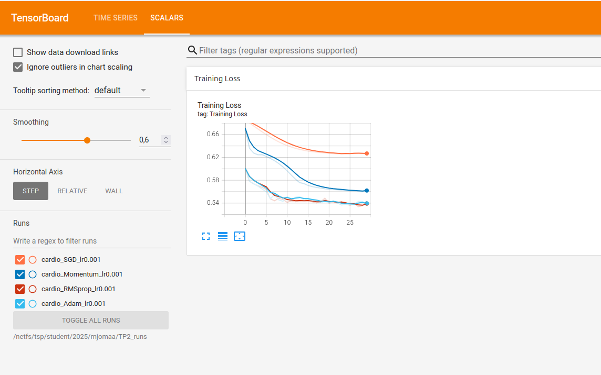

# CSC8607 — Introduction au Deep Learning

## TP2 — Compte rendu

**Étudiant :** Mohamed Rayen Jomaa  
**Date :** 24/09/2026

---

# Exercice 1 — Dataset personnalisé

Le dataset contient `70000` exemples.

Après le prétraitement, les dimensions obtenues sont :

```text
Shape features: torch.Size([64, 16])
Shape labels: torch.Size([64, 1])
```

Le modèle utilise donc `16` variables en entrée.

## Question 1

Dans le code fourni, `StandardScaler()` est appliqué sur tout le dataset avant le découpage train/validation/test.

C'est une mauvaise pratique car les statistiques utilisées pour la normalisation, notamment la moyenne et l'écart-type, sont alors calculées en utilisant également les données de validation et de test.

Il y a donc une **fuite de données (`data leakage`)** : des informations provenant indirectement du jeu de test sont utilisées avant l'entraînement.

Il faudrait d'abord effectuer le split, puis ajuster le scaler uniquement sur le jeu d'entraînement, avant de l'appliquer aux autres ensembles.

## Question 2

Si le dataset était trop volumineux pour tenir en RAM, par exemple `500 Go`, j'utiliserais :

```python
torch.utils.data.IterableDataset
```

Cette classe permet de lire progressivement les données au lieu de charger l'ensemble du dataset en mémoire.

---

# Exercice 2 — Régularisation L1 et L2

## Question 1 — Effet d'une régularisation L1 forte

Une première expérience a été réalisée avec :

```python
l1_lambda = 1e-4
l2_lambda = 1e-3
```

Résultats :

```text
Epoch 01 | loss=0.8504 | acc=0.6185
Epoch 02 | loss=0.8151 | acc=0.6436
Epoch 03 | loss=0.8024 | acc=0.6486
Epoch 04 | loss=0.7929 | acc=0.6512
Epoch 05 | loss=0.7868 | acc=0.6536
Epoch 06 | loss=0.7778 | acc=0.6562
Epoch 07 | loss=0.7691 | acc=0.6596
Epoch 08 | loss=0.7603 | acc=0.6625
Epoch 09 | loss=0.7514 | acc=0.6667
Epoch 10 | loss=0.7424 | acc=0.6711
```

La loss diminue progressivement et l'accuracy atteint `67.11 %`.

Le test demandé avec :

```python
l1_lambda = 0.1
l2_lambda = 0
```

donne :

```text
Epoch 01 | loss=6.6420 | acc=0.4979
Epoch 02 | loss=1.6340 | acc=0.5029
Epoch 03 | loss=1.6340 | acc=0.5075
Epoch 04 | loss=1.6340 | acc=0.5024
Epoch 05 | loss=1.6340 | acc=0.4992
Epoch 06 | loss=1.6340 | acc=0.4966
Epoch 07 | loss=1.6340 | acc=0.5024
Epoch 08 | loss=1.6340 | acc=0.5025
Epoch 09 | loss=1.6340 | acc=0.5004
Epoch 10 | loss=1.6340 | acc=0.5004
```

Avec `l1_lambda = 0.1`, l'accuracy reste proche de `50 %` et la loss reste bloquée autour de `1.6340`.

La régularisation est donc trop forte et empêche le réseau d'apprendre correctement. Ce phénomène correspond à du **sous-apprentissage (`underfitting`)**.

| Configuration | Loss finale | Accuracy finale |
| --- | ---: | ---: |
| `L1 = 1e-4`, `L2 = 1e-3` | 0.7424 | 67.11 % |
| `L1 = 0.1`, `L2 = 0` | 1.6340 | 50.04 % |

## Question 2 — Régularisation L2 automatique

Dans PyTorch, l'argument permettant d'appliquer automatiquement une régularisation L2 dans un optimiseur comme `SGD` est :

```python
weight_decay
```

Exemple :

```python
optimizer = optim.SGD(
    model.parameters(),
    lr=0.01,
    weight_decay=1e-3
)
```

## Question 3 — Différence entre L1 et L2

La régularisation **L1** pousse davantage certains poids vers zéro et peut donc produire un réseau plus parcimonieux.

La régularisation **L2** réduit progressivement l'amplitude des poids, sans généralement les annuler complètement.

---

# Exercice 3 — Comparaison des optimiseurs

Les quatre optimiseurs testés sont :

- SGD ;
- Momentum ;
- RMSprop ;
- Adam.

Ils ont été entraînés avec :

```text
learning_rate = 0.001
epochs = 30
```

## Question 1 — Capture TensorBoard

Les quatre courbes de perte sont superposées dans TensorBoard :



Les valeurs finales observées sont approximativement :

| Optimiseur | Loss finale |
| --- | ---: |
| Adam | 0.5373 |
| RMSprop | 0.5432 |
| Momentum | 0.5632 |
| SGD | ≈ 0.625 |

## Question 2 — Optimiseur convergeant le plus rapidement initialement

D'après les courbes TensorBoard obtenues, **RMSprop converge le plus rapidement pendant les premières époques**.

Adam possède également une convergence rapide, mais RMSprop présente la diminution initiale de loss la plus forte.

## Question 3 — Comparaison SGD et Momentum

La courbe avec Momentum descend plus rapidement que celle de SGD simple.

À la fin de l'entraînement :

```text
SGD      ≈ 0.625
Momentum ≈ 0.5632
```

L'ajout du Momentum accélère donc la descente de gradient et permet d'obtenir une loss plus faible sur les 30 époques.

---

# Exercice 4 — Precision, Recall, F1 et AUC

Le modèle retenu a été évalué sur le jeu de test.

Résultats obtenus :

```text
Precision: 0.7542
Recall:    0.7042
F1:        0.7284
AUC:       0.8035
```

| Métrique | Valeur |
| --- | ---: |
| Precision | 0.7542 |
| Recall | 0.7042 |
| F1-score | 0.7284 |
| AUC | 0.8035 |

## Question 1 — Precision et Recall

La **Precision** correspond à la proportion de prédictions positives qui sont réellement positives :

`Precision = TP / (TP + FP)`

Le **Recall** correspond à la proportion de cas réellement positifs détectés par le modèle :

`Recall = TP / (TP + FN)`

Dans notre cas :

```text
Precision = 0.7542
Recall    = 0.7042
```

## Question 2 — Quelle métrique privilégier en médecine ?

Dans le contexte de la détection d'une maladie cardiovasculaire, il est préférable de privilégier un **Recall élevé**.

Un Recall faible signifie que certains patients réellement malades sont classés comme non malades.

Ces faux négatifs sont particulièrement problématiques dans un contexte de dépistage médical, car ils peuvent conduire à ne pas détecter un patient nécessitant une prise en charge.

Il est donc généralement préférable d'accepter davantage de faux positifs plutôt que de manquer des patients réellement malades.

## Question 3 — Intérêt de l'AUC

La Precision, le Recall et le F1-score obtenus ici dépendent du seuil choisi pour transformer les probabilités en classes, ici :

```python
0.5
```

L'AUC permet d'évaluer la capacité du modèle à séparer les deux classes en considérant différents seuils de classification.

Dans notre cas :

```text
AUC = 0.8035
```

Elle fournit donc une évaluation plus globale du pouvoir de discrimination du modèle que les métriques calculées uniquement avec le seuil fixe de `0.5`.

---

# Conclusion

Les expériences réalisées montrent principalement que :

- une régularisation L1 trop forte conduit ici à du sous-apprentissage ;
- RMSprop converge le plus rapidement au début de l'entraînement ;
- Momentum améliore nettement la convergence par rapport à SGD simple ;
- le modèle final obtient une `Precision = 0.7542`, un `Recall = 0.7042`, un `F1 = 0.7284` et une `AUC = 0.8035`.
